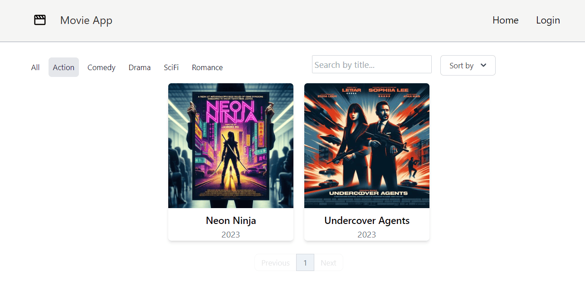

# 🎬 Welcome to Movie App 🍿

## 🚀 Tech Stack

### 🖥️ Frontend
- **React.js:** Power your user interface with React.js, a modern and efficient JavaScript library for building dynamic web applications.
- **React Router:** Seamlessly handle navigation and routing within the application to ensure a smooth user experience.
- **Tailwind CSS:** Create stylish and responsive designs effortlessly using Tailwind CSS, a utility-first CSS framework.
- **React Icons:** Access a vast library of high-quality icons to enhance the visual appeal and usability of the application. 😊

### ⚙️ Backend
- **.NET Core:** Harness the power of .NET Core, a versatile framework for building robust and scalable backend services.
- **Entity Framework Core:** Simplify data access and management with Entity Framework Core, an advanced object-relational mapper (ORM).
- **JWT Authentication:** Implement secure user authentication using JSON Web Tokens (JWT) to protect user data and ensure confidentiality.

🎬 **Lights, Camera, Action!** Dive into the mesmerizing world of movies with Movie App today! 🍿✨

### 📸 Screenshots
Here are some screenshots of our Movie App:

#### Further Improvements
1. **Ratings and Reviews:** Allow users to rate and leave reviews for movies, enhancing engagement and providing valuable feedback.
2. **Advanced Filtering:** Implement advanced filtering options such as genre, release year, rating, and more to help users discover new movies tailored to their preferences.
3. **Admin Dashboard:** Create an admin dashboard to manage movies, user accounts, reviews, and other app settings with ease.
4. **Enhanced Recommendations:** Utilize machine learning algorithms or collaborative filtering techniques to provide personalized movie recommendations based on user behavior and preferences.
5. **External APIs Integration:** Integrate with external APIs to fetch additional movie data, such as trailers, cast information, and related content, enriching the user experience. 🌟
